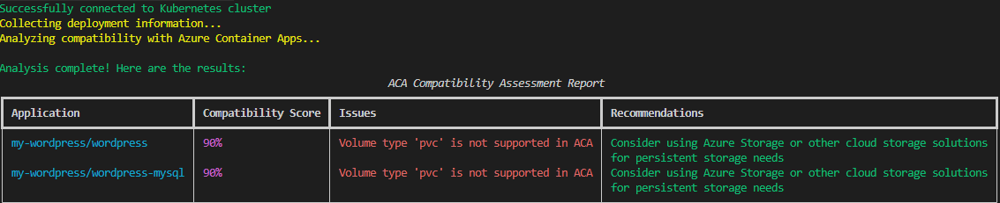

# ACA Assessor

A tool to assess Kubernetes applications for Azure Container Apps compatibility.

## Features

- Analyzes Kubernetes deployments for ACA compatibility
- Checks resource limits and requirements
- Validates volume configurations
- Analyzes networking settings
- Provides compatibility scores and recommendations
- Generates detailed reports
- Displays progress during assessment of multiple namespaces

## Installation

1. Clone the repository
2. Install the package:

```bash
pip install -e .
```

## Prerequisites

- Python 3.8 or higher
- Access to a Kubernetes cluster (configured kubectl)
- Azure CLI (optional, for Azure-related features)

## Usage

To assess all applications in your Kubernetes cluster:

```bash
aca-assess assess
```

This will show progress as it processes each namespace and analyzes all deployments.

To assess applications in a specific namespace:

```bash
aca-assess assess --namespace my-namespace
```

### Configuration File

ACA Assessor supports using a YAML configuration file to exclude namespaces from assessment.

To generate a default configuration file:

```bash
aca-assess assess --init-config
```

This creates an `aca-assessor.yaml` file in the current directory with example settings.

To use a specific configuration file:

```bash
aca-assess assess --config /path/to/my-config.yaml
```

Example configuration file:

```yaml
# ACA Assessor Configuration File

assessment:
  # List of namespaces to exclude from assessment
  excluded_namespaces:
    - kube-system
    - kube-public
    - istio-system
```

By default, ACA Assessor looks for a configuration file in these locations:
- `~/.aca-assessor.yaml` (user's home directory)
- `./.aca-assessor.yaml` (current directory)
- `./aca-assessor.yaml` (current directory)

## Assessment Criteria

The tool checks for:

- Resource limits (CPU and memory) compatibility
- Volume types and configurations
- Network protocols and ports
- Scaling configurations
- Environment variables and secrets
- Container configurations

## Report Format

The assessment generates a report showing:

- Compatibility score for each application
- Identified issues
- Specific recommendations
- Resource usage analysis

## Example

Command to assess a specific namespace:

```bash
aca-assess assess --namespace my-wordpress
```

Example output:




## Contributing

Contributions are welcome! Please feel free to submit pull requests.

## License

This project is licensed under the MIT License.
